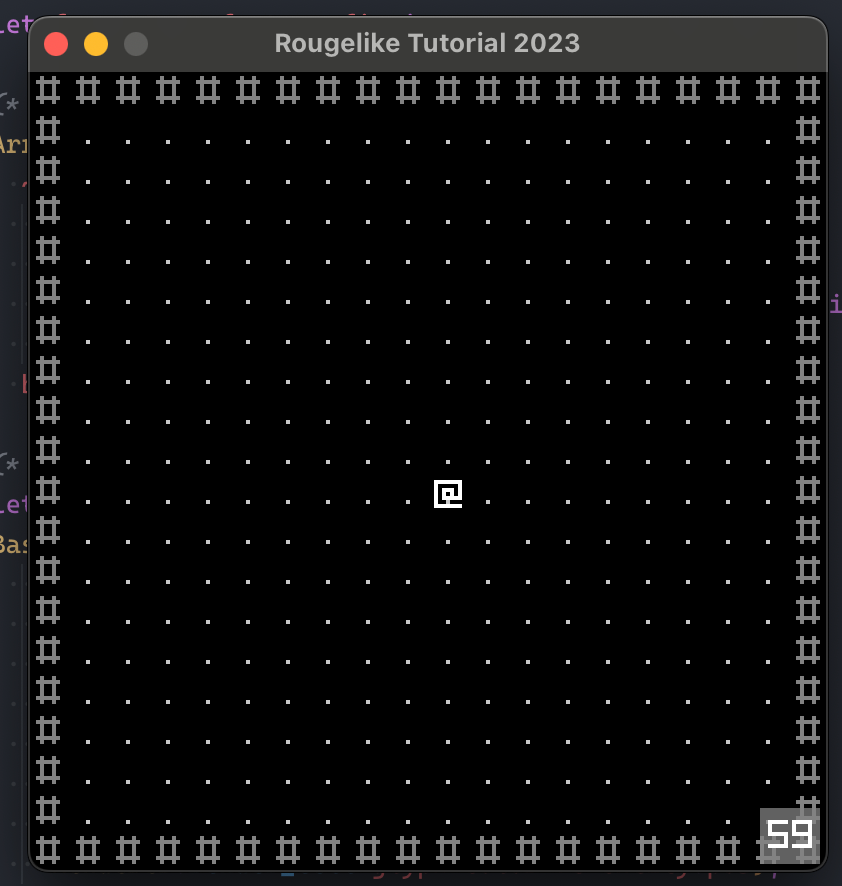
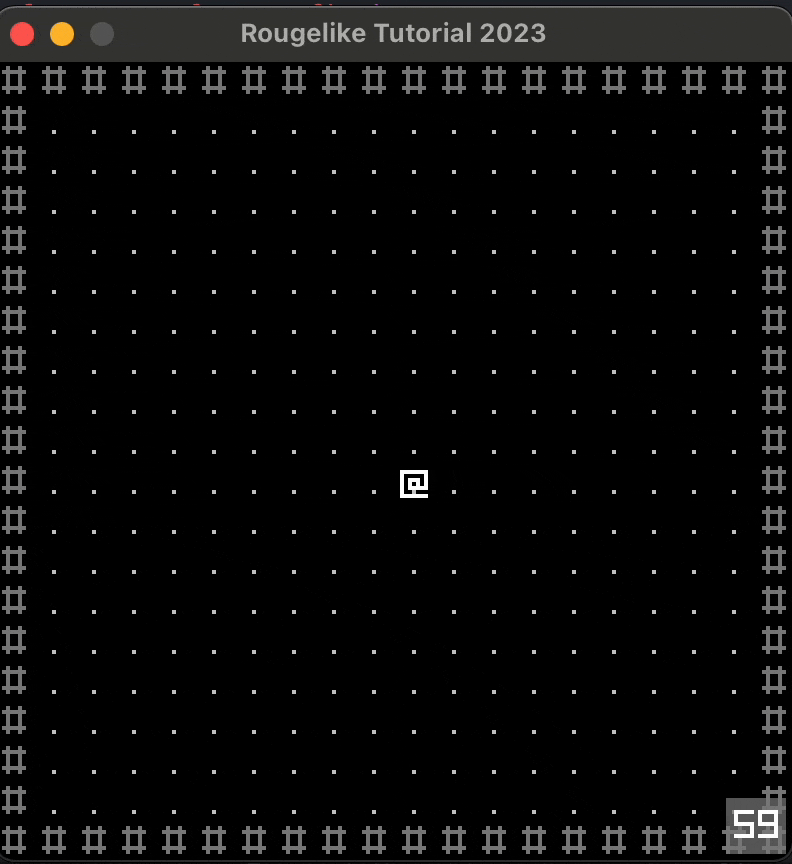

# RL2025 OCaml

Welcome to RL2025, an experimental roguelike game project built in OCaml! This project is designed for learning, experimentation, and fun with game design and functional programming.

---

## 🚀 Project Overview

RL2025 is a turn-based, entity-driven game engine and demo, using OCaml's strong type system and modern tooling. The project is structured for extensibility, maintainability, and clarity, making it a great starting point for both new and experienced OCaml developers interested in games.

- **Entity-Component System**: All game objects are managed via a flexible entity system.
- **Raylib Integration**: Uses Raylib (via OCaml bindings) for graphics, input, and audio.
- **Modular Architecture**: Clean separation of game logic, rendering, and resources.

---

## 📚 Documentation

- **[Project Memory Docs](.docs/memory/)**: In-depth architecture, guidelines, and roadmap
  - [Project Overview](.docs/memory/00_project_overview.md)
  - [Technical Architecture](.docs/memory/01_technical_architecture.md)
  - [Development Guidelines](.docs/memory/02_development_guidelines.md)
  - [Project Roadmap](.docs/memory/03_project_roadmap.md)
- [Project Structure and Module Dependency Overview](docs/project_structure.md): Mermaid charts and explanations of the architecture and module dependencies.

---

## 🛠️ Getting Started

### Prerequisites

- [OCaml](https://ocaml.org/) (recommended via [opam](https://opam.ocaml.org/))
- [Dune](https://dune.build/)
- [Raylib](https://www.raylib.com/) (and OCaml bindings)

### Installation

```sh
opam install . --deps-only
```

### Build & Run

```sh
dune build
dune exec rl2025
```

---

## 🏗️ Project Structure

- `src/` — Main source code
- `lib/` — Shared libraries
- `test/` — Tests
- `media/` — Screenshots and assets
- `resources/` — Game resources
- `static/` — Static files
- `.docs/memory/` — Project documentation

---

## 🧑‍💻 Contributing

We welcome contributions! To get started:

1. Fork the repository
2. Create a feature branch
3. Submit a pull request

Please read our [Development Guidelines](.docs/memory/02_development_guidelines.md) before contributing.

---

## 📸 Screenshots

<div align="center">
<table>
<tr>
<td width="400px" align="center">
  <br/>
  <em>Base Screen - Main Menu</em>
</td>
<td width="400px" align="center">
  <br/>
  <em>Gameplay Demo</em>
</td>
</tr>
</table>
</div>

---

## 📄 License

MIT — see [LICENSE](LICENSE) for details.

---

## 💡 More Info

- For technical details, see the [Technical Architecture](.docs/memory/01_technical_architecture.md).
- For project goals and roadmap, see the [Project Roadmap](.docs/memory/03_project_roadmap.md).
- For help or questions, open an issue or discussion!
