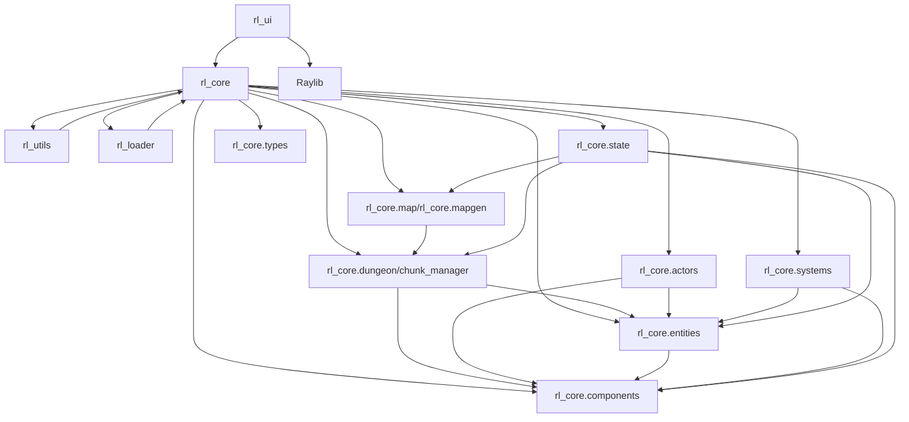
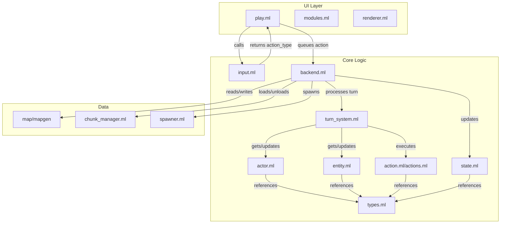

# System Architecture: Echoes in the Dark

This document describes the high-level architecture of the Echoes in the Dark roguelike engine, focusing on modularity, extensibility, and the new chunking system for infinite/procedural worlds.

---

## 1. Overview

Echoes in the Dark is built around a modular, entity-component-system (ECS) core, with a focus on functional OCaml patterns and clean separation of concerns. The architecture is designed for easy extension, robust gameplay logic, and efficient rendering/input via Raylib bindings.

- **Entity-Component System (ECS):** All game objects are entities with attached components (position, stats, renderable, etc.). Systems operate on entities with relevant components.
- **Chunking System:** The world is divided into 32x32 tile chunks, loaded/unloaded dynamically around the player for infinite/procedural exploration. See [chunking_design.md](chunking_design.md).
- **Modular Layers:**
  - **UI Layer:** Handles rendering, input, and user feedback (via Raylib).
  - **Core Logic:** Game rules, ECS, map/chunk management, turn system, AI, etc.
  - **Resource/Loader Layer:** Loads assets, prefabs, and resources.
  - **Utils:** Shared utilities, helpers, and functional patterns.

---

## 2. Major Modules & Relationships

**Key Points:**

- The UI layer depends on both the core logic and Raylib.
- The core logic is composed of submodules for actors, entities, components, systems, map/chunk management, and state.
- The chunking system is central to world management and interacts with mapgen, entities, and state.
- All modules use functional, OCaml-idiomatic patterns and the Base library.

---

## 3. Chunking System

See [chunking_design.md](chunking_design.md) for a detailed design. In summary:

- The world is split into 32x32 tile chunks, loaded/unloaded in a 5x5 grid around the player.
- Chunks are generated deterministically using coordinate-based seeding for infinite/procedural worlds.
- Entities are managed globally, but each chunk tracks which entities are present within its bounds.
- The renderer and systems query the chunk manager for tile/entity data as needed.

---

## 4. Data & Control Flow

---

## 5. External Dependencies

- **Raylib:** Graphics, input, and audio via OCaml bindings.
- **Base:** Modern standard library for OCaml, used throughout the codebase.
- **Other Libraries:** Noise generation for mapgen, etc.

---

## 6. Extensibility & Testing

- The modular design allows for easy addition of new systems, components, and features.
- All code follows functional, OCaml-idiomatic patterns (see [workflow_policies.md](workflow_policies.md)).
- Testing and documentation are encouraged for all new modules.

---

*See also: [chunking_design.md](chunking_design.md), [project_structure.md](project_structure.md), [workflow_policies.md](workflow_policies.md)*
