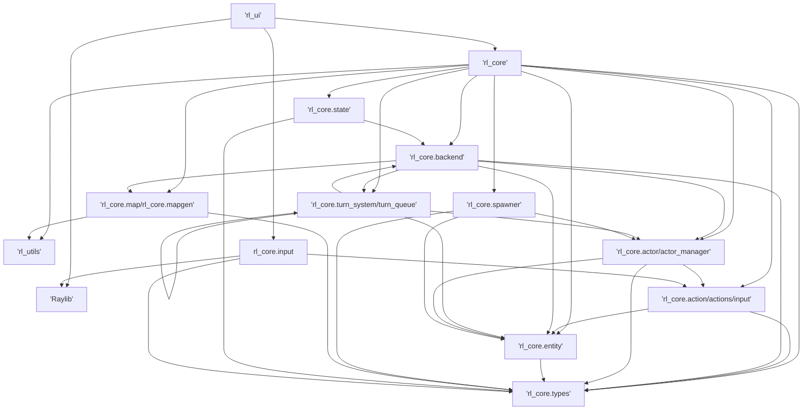
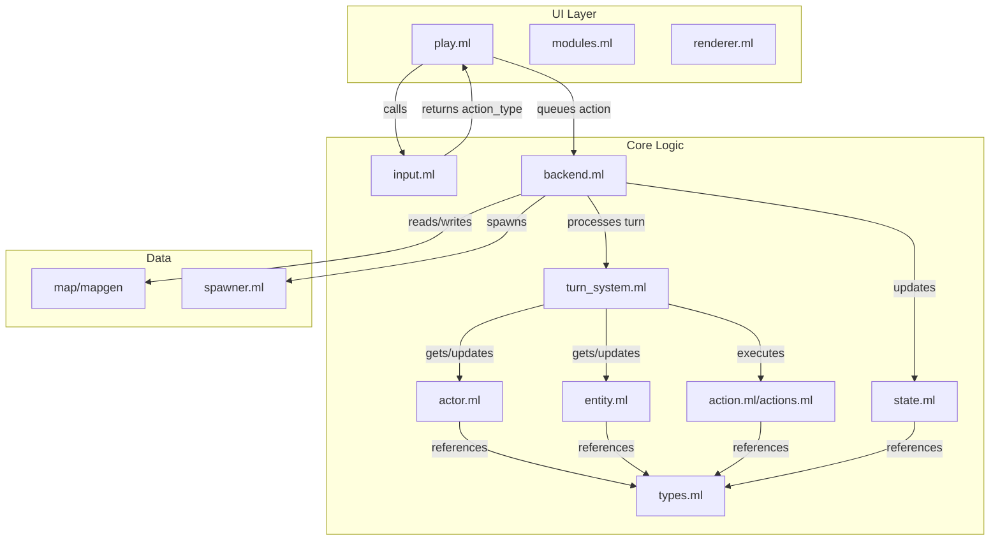
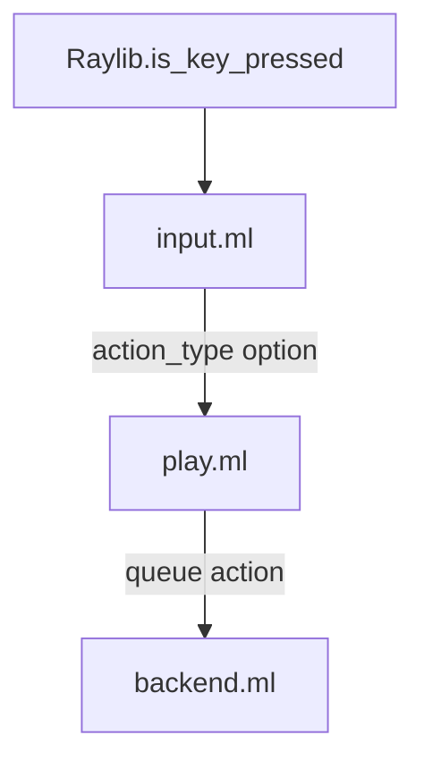

# Project Structure and Module Dependency Overview

This document provides a high-level overview of the architecture and module dependencies for the project, using Mermaid diagrams for clarity.

---

## 1. Core Module Dependency Flow

**Explanation:**

- Shows the main modules and their dependencies.
- UI depends on both rl_core and Raylib.
- rl_core is composed of several submodules, each with their own dependencies.

---

## 2. Game Loop and Data Flow

**Explanation:**

- Illustrates the flow of data and control through the main game loop.
- Shows how input is processed, actions are queued, and the backend updates the game state.

---

## 3. Input Handling Flow

**Explanation:**

- Shows how input is handled from the raw key press to the action being queued for the backend.

---

This structure is modular, testable, and easy to extend. Update this document as the architecture evolves.
