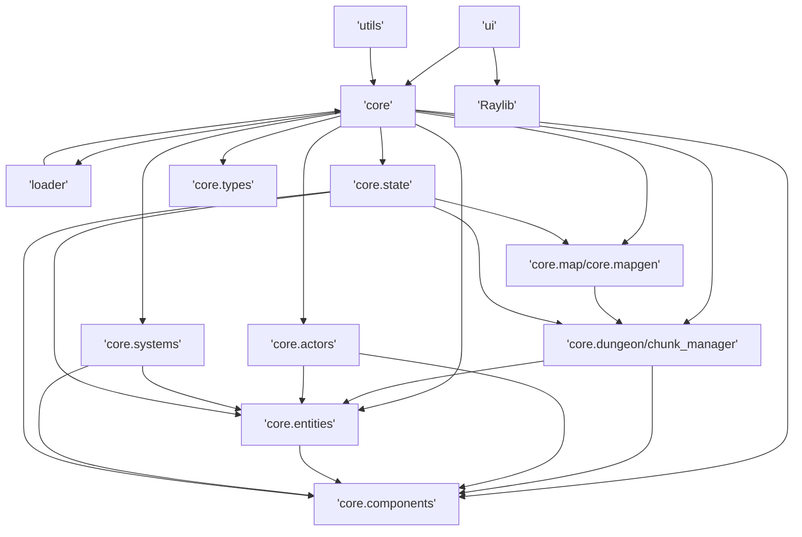
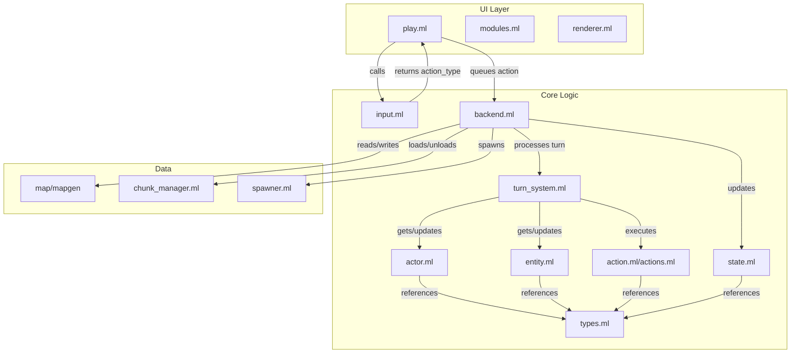
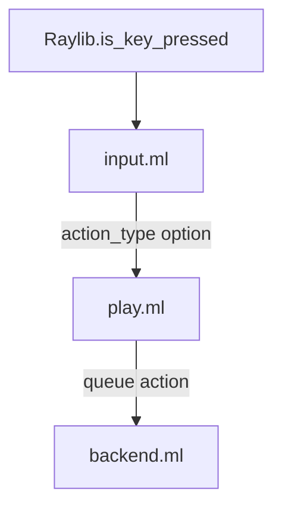

# Project Structure and Module Dependency Overview

This document provides an up-to-date overview of the architecture and module dependencies for Echoes in the Dark, including directory/module descriptions and diagrams. For a high-level system view, see [architecture.md](architecture.md). For chunking details, see [chunking_design.md](chunking_design.md).

---

## 1. Directory & Module Overview

- **src/** — Main source code
  - **bin/** — Game entry point(s)
  - **core/** — Core game logic (ECS, systems, map/chunk management, etc.)
    - **actors/** — Actor/AI logic
    - **components/** — ECS components (position, stats, etc.)
    - **dungeon/** — Chunking, mapgen, tile types
    - **entities/** — Entity spawning and management
    - **events/** — Event system
    - **mapgen/** — Procedural map/chunk generation
    - **state/** — Game state, save/load
    - **systems/** — ECS systems (movement, combat, etc.)
  - **loader/** — Resource and prefab loading
  - **ui/** — UI, rendering, input (Raylib integration)
  - **utils/** — Shared utilities and helpers
- **test/** — Tests
- **media/** — Screenshots and assets
- **resources/** — Game resources (fonts, images, prefabs, tiles)
- **docs/** — Documentation

---

## 2. Core Module Dependency Flow

**Explanation:**

- UI depends on both core and Raylib.
- core is composed of several submodules, each with their own dependencies.
- The chunking system (dungeon/chunk_manager) is central to world management.

---

## 3. Game Loop and Data Flow

**Explanation:**

- Shows the flow of data and control through the main game loop.
- Input is processed, actions are queued, backend updates state, and chunking is managed dynamically.

---

## 4. Input Handling Flow

**Explanation:**

- Shows how input is handled from the raw key press to the action being queued for the backend.

---

## 5. Cross-References

- For high-level architecture: [architecture.md](architecture.md)
- For chunking system: [chunking_design.md](chunking_design.md)
- For workflow/coding policies: [workflow_policies.md](workflow_policies.md)
